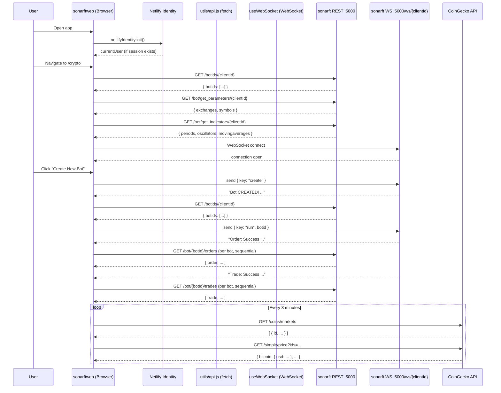

# sonarftweb — API Integration & sonarft Communication

**Prompt:** 02-api-integration  
**Category:** Client-Server Integration  
**Date:** July 2025  
**Depends on:** [docs/architecture/structure.md](../architecture/structure.md)

---

## Executive Summary

sonarftweb communicates with the sonarft backend via two channels: native `fetch` for REST calls (centralized in `utils/api.js`) and native `WebSocket` for real-time bot control and log streaming. The REST layer is well-organized with a consistent fallback pattern, but has significant gaps: no authentication tokens are passed to the backend, URLs are hardcoded to `localhost`, there is no timeout or retry logic, several functions lack error handling, and all errors are silently logged to the console with no user-facing feedback. The CoinGecko integration uses `axios` but is entirely separate from the sonarft API layer. The overall integration is functional for local development but is not production-ready.

---

## 1. API Client Setup

### sonarft Backend (REST)

- **HTTP client:** Native `fetch` API — no third-party library
- **Base URL:** Hardcoded string constant in `utils/constants.js`:
  ```js
  const HTTPURL = "http://localhost:5000";
  export const HTTP = HTTPURL;
  ```
  Multiple commented-out alternatives exist (IP address, ngrok URL) indicating manual environment switching.
- **Default headers:** Every call manually sets the same headers inline — no shared configuration:
  ```js
  headers: {
      Accept: "application/json",
      "Content-Type": "application/json",
  }
  ```
- **Interceptors:** None. No request/response interceptors exist.
- **Timeout:** None configured anywhere.
- **Retry logic:** None. The only resilience is the fallback chain in `getDefaultParameters` and `getDefaultIndicators` (server → local JSON), which is not a retry — it's a data source fallback.
- **Authentication headers:** None. No `Authorization` header or token is passed to any sonarft endpoint.

### CoinGecko (External)

- **HTTP client:** `axios` ^1.4.0
- **Usage:** `CryptoTicker.js` and `CChatGPT.js` call CoinGecko's public API directly with `axios.get(...)`. No base URL configuration, no interceptors, no auth (public API).
- **Polling interval:** Both components poll every 180,000ms (3 minutes) via `setInterval`.

---

## 2. Authentication & Authorization

| Aspect | Implementation | Assessment |
|---|---|---|
| Auth provider | Netlify Identity (`netlify-identity-widget`) | Third-party widget; not a custom JWT/session system |
| Token storage | Managed internally by `netlify-identity-widget` (localStorage) | Not directly accessible in app code |
| Token passed to sonarft | **Never** — no Authorization header on any fetch call | Critical gap: sonarft backend has no way to verify the caller |
| Token refresh | Handled by Netlify Identity widget internally | ⚠️ Not Found in Source Code (app-level) |
| Session persistence | `netlifyIdentity.currentUser()` checked on mount in `AuthProvider` | Works on page reload |
| Logout | `netlifyIdentity.logout()` → clears widget state → `setUser(null)` | Correct |
| Protected routes | `PrivateRoute` component in `Crypto.js`, `Dex.js`, `Forex.js`, `Token.js` — redirects to `/` if `user` is null | Correct pattern, but duplicated in every page file |

**Critical finding:** The Netlify Identity auth is purely a frontend gate. The sonarft backend receives no authentication credentials — any client that knows the `clientId` (which is the Netlify user UUID) can call any sonarft endpoint directly without authentication. The `clientId` is passed as a URL path parameter, not as a secret.

---

## 3. API Endpoint Usage

### sonarft REST Endpoints

| Endpoint | Method | Called From | Trigger | Request Body | Error Handling | Loading State |
|---|---|---|---|---|---|---|
| `/botid/{clientId}` | GET | `api.js: getBotId` | — (defined but unused) | None | try/catch, throws | None |
| `/botids/{clientId}` | GET | `Bots.js` via `getBotIds` | On mount, after BOT_CREATED | None | **No try/catch** | `isLoading` flag |
| `/bot/{botId}/orders` | GET | `helpers.js` via `getOrders` | After ORDER_SUCCESS WS message | None | Returns `null` on !ok | None |
| `/bot/{botId}/trades` | GET | `helpers.js` via `getTrades` | After TRADE_SUCCESS WS message | None | Returns `null` on !ok | None |
| `/default_parameters` | GET | `Parameters.js` via `getDefaultParameters` | On mount (fallback) | None | try/catch, falls back to local JSON | None |
| `/bot/get_parameters/{clientId}` | GET | `Parameters.js` via `getParameters` | On mount (primary) | None | try/catch, throws | None |
| `/bot/set_parameters/{clientId}` | POST | `Parameters.js` via `updateParameters` | "Set bot parameters" button | `{ exchanges, symbols }` | try/catch, throws | None |
| `/default_indicators` | GET | `Indicators.js` via `getDefaultIndicators` | On mount (fallback) | None | try/catch, falls back to local JSON | None |
| `/bot/get_indicators/{clientId}` | GET | `Indicators.js` via `getIndicators` | On mount (primary) | None | try/catch, throws | None |
| `/bot/set_indicators/{clientId}` | POST | `Indicators.js` via `updateIndicators` | "Set bot indicators" button | `{ periods, oscillators, movingaverages }` | try/catch, throws | None |

### CoinGecko External Endpoints

| Endpoint | Method | Called From | Trigger | Purpose |
|---|---|---|---|---|
| `/api/v3/coins/markets` | GET (axios) | `CryptoTicker.js`, `CChatGPT.js` | On mount + every 3 min | Fetch top N coin IDs |
| `/api/v3/simple/price` | GET (axios) | `CryptoTicker.js`, `CChatGPT.js` | After markets call | Fetch USD prices |

---

## 4. Error Handling Patterns

### Current State

```
getDefaultParameters / getDefaultIndicators   → try/catch → fallback to local JSON  ✓
getParameters / getIndicators / updateX       → try/catch → console.log → re-throw  ⚠
getBotId                                      → try/catch → console.log → re-throw  ⚠
getBotIds                                     → no try/catch → unhandled rejection   ✗
getOrders / getTrades                         → no try/catch → returns null on !ok   ⚠
```

### Issues

- **No user-facing error messages anywhere.** All errors go to `console.log` or `console.error`. Users see nothing when an API call fails.
- **`getBotIds` has no error handling.** If the server is unreachable on mount, `Bots.js` will throw an unhandled promise rejection. The `isLoading` flag is set in a `finally` block, so it clears correctly, but the error is swallowed silently.
- **Re-throwing errors from `api.js` without catching in components.** `Parameters.js` and `Indicators.js` call `getParameters`/`getIndicators` in `componentDidMount` with a try/catch that only logs — the UI shows nothing to the user.
- **No error boundaries.** A runtime error in `Bots.js` or `Parameters.js` would crash the entire `Crypto` page with a blank screen.
- **HTTP status codes partially checked.** `getOrders` and `getTrades` check `response.ok` and return `null`, but callers in `helpers.js` silently skip null entries without notifying the user.

### Recommended Pattern

```js
// In api.js — consistent pattern
export const getBotIds = async (clientId) => {
    try {
        const response = await fetch(HTTP + `/botids/${clientId}`, { ... });
        if (!response.ok) throw new Error(`HTTP ${response.status}`);
        const data = await response.json();
        return data.botids;
    } catch (e) {
        console.error("getBotIds failed:", e.message);
        throw e; // let caller decide UI response
    }
};

// In component — surface errors to user
const [error, setError] = useState(null);
try {
    const ids = await getBotIds(clientId);
    setBotIds(ids);
} catch (e) {
    setError("Could not load bots. Is the server running?");
} finally {
    setIsLoading(false);
}
```

---

## 5. Request Patterns & Best Practices

| Pattern | Status | Notes |
|---|---|---|
| Batch requests | Not used | Orders and trades are fetched sequentially per bot ID in `helpers.js` (for loop, not `Promise.all`) |
| Request deduplication | Not implemented | Multiple rapid WebSocket messages could trigger concurrent identical fetches |
| Caching | None (sonarft API) | Parameters/Indicators use localStorage as a cache, but it's not invalidated on server changes |
| Throttling / debouncing | None | "Set parameters" button can be clicked repeatedly with no guard |
| Request cancellation | None | No `AbortController` usage; stale responses can update state after unmount |
| Race conditions | Present | In `Bots.js`, `socket.onmessage` triggers async fetches; if messages arrive rapidly, state updates may interleave |

### Sequential vs Parallel in helpers.js

```js
// Current — sequential (slow for many bots)
export const fetchAllOrders = async (botIds) => {
    const allOrders = [];
    for (const id of botIds) {
        const orderData = await getOrders(id);  // awaits each one
        if (orderData) allOrders.push(...orderData);
    }
    return allOrders;
};

// Better — parallel
export const fetchAllOrders = async (botIds) => {
    const results = await Promise.all(botIds.map(id => getOrders(id)));
    return results.filter(Boolean).flat();
};
```

---

## 6. Response Handling

| Aspect | Status | Notes |
|---|---|---|
| Data transformation | Minimal | Response JSON is used directly; no normalization layer |
| Response validation | None | No schema validation; if server returns unexpected shape, components silently render nothing or crash |
| Type checking | None | No TypeScript or PropTypes on API responses |
| Pagination | Not implemented | Order/trade history is returned as a full array; no pagination for large datasets |
| Data consistency | Weak | `botIds` state in `Bots.js` can be stale between WebSocket events |

### Fallback Data Mismatch

The fallback JSON files have inconsistent structures:

- `public/defaultParameters.json` returns `{ market, exchange, symbols, parameters }` — flat strings
- `src/utils/parameterOptions.json` returns `{ exchanges: {}, symbols: {} }` — checkbox maps

`Parameters.js` uses `getDefaultParameters()` which tries the server first, then falls back to `parameterOptions.json`. The `public/defaultParameters.json` file is never used by the app — it appears to be a legacy artifact. This creates confusion about which fallback is authoritative.

Similarly:
- `public/defaultIndicators.json` returns `{ indicator, period }` — flat strings
- `src/utils/indicatorOptions.json` returns `{ periods: {}, oscillators: {}, movingaverages: {} }` — checkbox maps

The `public/` JSON files do not match the shape the components expect.

---

## 7. Loading & Skeleton States

| Component | Loading State | Error State | Empty State |
|---|---|---|---|
| `Bots.js` | `isLoading` → renders `<div>Loading...</div>` | None shown to user | Bot selector renders empty |
| `Parameters.js` | None | None shown to user | Checkboxes render empty |
| `Indicators.js` | None | None shown to user | Checkboxes render empty |
| `CryptoTicker.js` | None (banner just empty) | `console.error` only | Banner renders empty |
| `CChatGPT.js` | None | `console.error` only | Section renders empty |

Only `Bots.js` has any loading indicator. No component shows an error state to the user. No skeleton screens are used anywhere.

---

## 8. API Documentation & Constants

### URL Configuration

```js
// utils/constants.js — current state
const HTTPURL = "http://localhost:5000";       // active
const WSURL = "ws://localhost:5000/ws";        // active
//const HTTPURL = "https://100.66.35.193:5000"; // commented out
//const WSURL = "wss://100.66.35.193:5000/ws";  // commented out
//const HTTPURL = "https://81f5-...ngrok...";   // commented out
//const WSURL = "wss://81f5-...ngrok...";       // commented out
```

No environment variable usage. Switching environments requires editing source code. The correct approach:

```js
// utils/constants.js — recommended
const HTTPURL = process.env.REACT_APP_API_URL || "http://localhost:5000";
const WSURL = process.env.REACT_APP_WS_URL || "ws://localhost:5000/ws";
```

### Endpoint Constants

Endpoint paths are not defined as constants — they are constructed inline as template literals in each `api.js` function. There is no central endpoint registry. Message string constants (`BOT_CREATED_MESSAGE`, etc.) are correctly centralized in `constants.js`.

### API Version Handling

No API versioning. No `/v1/` prefix in any endpoint. If the sonarft backend introduces breaking changes, there is no version negotiation mechanism.

### Mock Data / Testing

No mock data layer exists. `App.test.js` contains a single broken test (`getByText(/learn react/i)` — the app renders "SonarFT", not "learn react"). No API mocking with MSW or similar.

---

## 9. sonarft-Specific Integration

### Bot Lifecycle via WebSocket

The bot control flow is entirely WebSocket-driven. REST is only used for reading state (bot IDs, history) and configuration (parameters, indicators). The command flow:

```
User clicks "Create" → send { key: "create" }
Server responds "Bot CREATED!" → fetch botIds → send { key: "run", botid }
User clicks "Remove" → send { key: "remove", botid }
Server responds "Bot REMOVED!" → update local state
```

This text-parsing approach (checking `event.data.includes("Bot CREATED!")`) is fragile — any change to the server's log message format silently breaks the client.

### Parameters & Indicators Configuration

Both `Parameters` and `Indicators` follow the same pattern:
1. On mount: try server → try localStorage → try bundled JSON fallback
2. User edits checkboxes → updates component state + writes to localStorage
3. User clicks "Set" → POST to server

The localStorage write happens on every checkbox change, but the server POST only happens on explicit button click. This means localStorage and server can diverge if the user edits but doesn't click "Set".

### Missing Integration Points

The following sonarft backend capabilities have no corresponding frontend integration:

| sonarft Feature | Backend Endpoint | Frontend Status |
|---|---|---|
| Per-bot order history | `GET /bot/{botid}/orders` | Implemented |
| Per-bot trade history | `GET /bot/{botid}/trades` | Implemented |
| Default validators | `GET /default_validators` (inferred) | ⚠️ Not Found in Source Code |
| Per-client validators | `GET/POST /bot/get_validators` (inferred) | ⚠️ Not Found in Source Code |
| Bot status / health | — | ⚠️ Not Found in Source Code |
| Live price data | — | ⚠️ Not Found in Source Code (only log stream) |

Note: `public/defaultValidators.json` and `src/components/Config/` contain validator-related code, but validators are not wired into the active `App.js` routing.

---

## 10. Security Concerns

| Issue | Severity | Detail |
|---|---|---|
| No auth token sent to sonarft backend | Critical | Any caller knowing a `clientId` (Netlify user UUID) can manage bots, read trade history, and change parameters without authentication |
| HTTP (not HTTPS) to backend | High | `http://localhost:5000` — plaintext in production would expose all trading data and commands |
| `clientId` is a UUID in URL path | Medium | UUIDs are not secret; they appear in browser history, server logs, and network tab |
| Hardcoded URLs with commented credentials | Medium | Commented-out IP addresses and ngrok URLs in source code leak infrastructure details |
| No input sanitization on WebSocket messages | Medium | `event.data` is appended directly to `logs` state and rendered in a `<pre>` tag — XSS risk if server ever sends HTML/script content |
| `console.log` of API errors | Low | Error messages may contain server details; visible in browser DevTools |
| CoinGecko called over HTTPS | None | External API uses HTTPS correctly |

### XSS Risk in Log Rendering

```jsx
// Bots.js — current
<pre className="console">
    {logs}   {/* logs is a string built by concatenating event.data */}
</pre>
```

React's JSX escapes string content in `{logs}`, so this is safe as long as `logs` remains a plain string. However, if this were ever changed to use `dangerouslySetInnerHTML`, it would become a direct XSS vector. The pattern should be documented as intentionally safe.

---

## 11. Performance Considerations

| Issue | Severity | Detail |
|---|---|---|
| Sequential order/trade fetches per bot | Medium | `helpers.js` uses a `for` loop with `await` — O(n) sequential requests instead of parallel `Promise.all` |
| CoinGecko makes 2 requests per poll cycle | Low | First fetches coin IDs, then fetches prices — could be combined into one request |
| No request deduplication | Medium | Rapid WebSocket messages (e.g., multiple ORDER_SUCCESS in quick succession) trigger multiple concurrent identical fetches |
| No AbortController on unmount | Medium | If `Bots.js` unmounts while a fetch is in flight, the response will attempt to call `setState` on an unmounted component (React 18 suppresses the warning but the fetch still completes) |
| `axios` imported only for CoinGecko | Low | `axios` adds ~14KB gzipped to the bundle; could be replaced with `fetch` to eliminate the dependency |
| No HTTP caching headers respected | Low | All fetch calls use default cache behavior; no `Cache-Control` or `ETag` handling |

---

## 12. API Integration Diagram



---

## Summary of Issues by Priority

| Priority | Issue | File | Recommendation |
|---|---|---|---|
| Critical | No auth token sent to sonarft backend | `utils/api.js` | Pass Netlify Identity JWT in `Authorization: Bearer` header |
| High | HTTP not HTTPS to backend | `utils/constants.js` | Use HTTPS in production; enforce via env var |
| High | Hardcoded localhost URLs | `utils/constants.js` | Use `REACT_APP_API_URL` / `REACT_APP_WS_URL` env vars |
| High | `getBotIds` has no error handling | `utils/api.js` | Add try/catch consistent with other functions |
| High | No user-facing error messages | All components | Add error state + UI feedback in `Bots`, `Parameters`, `Indicators` |
| Medium | Sequential order/trade fetches | `utils/helpers.js` | Replace `for` loop with `Promise.all` |
| Medium | No request cancellation on unmount | `Bots.js` | Use `AbortController` or check mounted flag |
| Medium | Text-parsing WebSocket messages | `Bots.js` | Use structured JSON messages from server instead of string matching |
| Medium | No request deduplication | `Bots.js` | Debounce or deduplicate fetch triggers from WebSocket messages |
| Medium | `public/default*.json` shape mismatch | `public/` | Align or remove the unused `public/` fallback files |
| Low | `axios` used only for CoinGecko | `CryptoTicker.js`, `CChatGPT.js` | Replace with `fetch` to remove the dependency |
| Low | No API version in endpoints | `utils/api.js` | Add `/v1/` prefix or version header for future compatibility |
| Low | No loading states in Parameters/Indicators | `Parameters.js`, `Indicators.js` | Add loading indicator during `componentDidMount` fetch |

---

**Save location:** `docs/api-integration/sonarft-integration.md`  
**Next prompts:** `03-state-management.md`, `05-real-time-updates.md`, `06-authentication-security.md`
