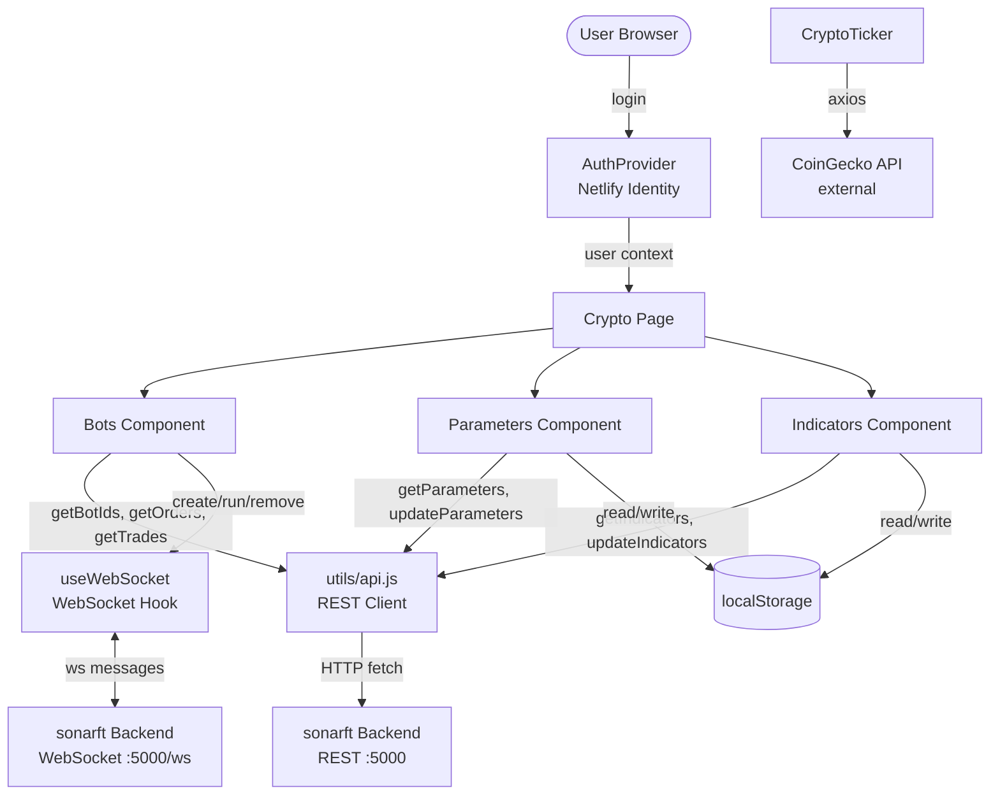
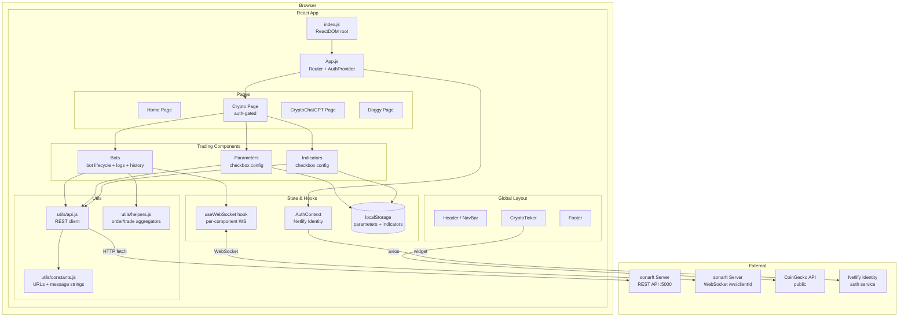

# sonarftweb — Architecture & Project Structure

**Prompt:** 01-architecture-structure  
**Category:** Architecture & Design  
**Date:** July 2025

---

## Executive Summary

sonarftweb is a React 18 single-page application that serves as the frontend client for the sonarft trading server. The codebase is organized by component type (components, pages, hooks, utils) and uses a mix of class and functional components. The architecture is functional but shows signs of early-stage development: two parallel App entry points exist, two WebSocket implementations coexist without a clear winner, several providers are created but never wired into the app, and backend URLs are hardcoded. The core trading flow (auth → bot management → parameters/indicators → real-time logs) is implemented and working. The main areas needing attention are architectural consistency, state management consolidation, and security hardening.

---

## 1. Technology Stack Inventory

| Category | Technology | Version | Notes |
|---|---|---|---|
| UI Framework | React | ^18.2.0 | Functional + class components mixed |
| Routing | react-router-dom | ^6.15.0 | BrowserRouter, Routes, Route |
| HTTP Client | fetch (native) + axios | axios ^1.4.0 | fetch used for sonarft API; axios for CoinGecko |
| WebSocket | Native `WebSocket` API | — | Two separate implementations (see §3) |
| State Management | React Context API + component state | — | No Redux/Zustand |
| Authentication | netlify-identity-widget | ^1.9.2 | Netlify Identity, not JWT/custom auth |
| Styling | Plain CSS + CSS variables | — | Per-component CSS files + global variables.css |
| Build Tool | Create React App (react-scripts) | 5.0.1 | Webpack under the hood |
| Package Manager | npm + yarn | — | Both `package-lock.json` and `yarn.lock` present |
| Testing | @testing-library/react + Jest | ^13.4.0 | Only `App.test.js` exists |
| Linting | ESLint (react-app preset) | — | `.hintrc` also present |
| Formatting | Prettier | ^3.0.3 | `format` script in package.json |
| UUID | uuid | ^9.0.0 | Used in Config.js for indicator/validator IDs |
| CI/CD | Google Cloud Build | — | `cloudbuild.yaml` present |
| Containerization | Docker + Docker Compose | — | `Dockerfile` + `docker-compose.yml` |

---

## 2. Directory Structure & Module Organization

```
sonarftweb/
├── public/                     # Static assets + fallback JSON configs
│   ├── defaultIndicators.json
│   ├── defaultParameters.json
│   ├── defaultValidators.json
│   ├── indicators.json
│   ├── matrixDefinitions.json
│   └── stats.json
├── src/
│   ├── assets/img/             # Static images (logo, background)
│   ├── components/             # Reusable UI components (by feature folder)
│   │   ├── Bots/               # Bot management + trade/order history
│   │   ├── Building/           # Placeholder "under construction" component
│   │   ├── CChatGPT/           # CoinGecko price widget (single coin)
│   │   ├── Config/             # Legacy config panel (class-based, not routed)
│   │   ├── CryptoTicker/       # Scrolling top-20 price banner
│   │   ├── DoggyWelcome/       # Doggy page welcome component
│   │   ├── Footer/             # Global footer
│   │   ├── Header/             # Global header (wraps NavBar)
│   │   ├── Indicators/         # Indicator checkbox config (class-based)
│   │   ├── NavBar/             # NavBar.js (current) + NavBar_Trading.js (alternate)
│   │   └── Parameters/         # Parameter checkbox config (class-based)
│   ├── hooks/                  # Auth provider + WebSocket hooks/context
│   │   ├── AuthProvider.js     # Netlify Identity context
│   │   ├── useWebSocket.jsx    # Custom hook: per-component WS connection
│   │   └── WebSocketContext.js # Context-based shared WS provider
│   ├── pages/                  # Full-page route targets
│   │   ├── Crypto/             # Main trading page (auth-gated)
│   │   ├── CryptoChatGPT/      # ChatGPT crypto page
│   │   ├── Dex/                # DEX page (Building placeholder)
│   │   ├── Doggy/              # Doggy page
│   │   ├── Forex/              # Forex page (Building placeholder)
│   │   ├── Home/               # Landing page + Welcome subcomponent
│   │   └── Token/              # Token page (Building placeholder)
│   ├── utils/
│   │   ├── api.js              # All sonarft REST API calls
│   │   ├── constants.js        # URLs + WebSocket address + message constants
│   │   ├── helpers.js          # fetchAllOrders / fetchAllTrades aggregators
│   │   ├── indicatorOptions.json  # Fallback indicator config
│   │   └── parameterOptions.json  # Fallback parameter config
│   ├── App.js                  # Active app entry (Crypto + ChatGPT + Doggy routes)
│   ├── App_Trading.js          # Alternate app entry (Forex + DEX + Token routes)
│   ├── index.js                # ReactDOM root render
│   ├── variables.css           # CSS custom properties (design tokens)
│   ├── reset.css               # CSS reset
│   ├── index.css               # Global base styles
│   └── styles.css              # App-level layout styles
```

**Organization principle:** by component type at the top level (components, pages, hooks, utils), then by feature within each directory. This is a standard CRA layout.

---

## 3. Component Architecture

### Component Types

| Component | File | Type | Purpose | Key Props | Reusable? |
|---|---|---|---|---|---|
| App | App.js | Functional | Root router, auth wrapper | — | No |
| App_Trading | App_Trading.js | Functional | Alternate root router | — | No |
| AuthProvider | hooks/AuthProvider.js | Functional (Context) | Netlify Identity auth state | children | Yes |
| NavBar | NavBar/NavBar.js | Functional | Navigation + auth buttons | — (uses context) | Yes |
| NavBar_Trading | NavBar/NavBar_Trading.js | Functional | Alternate nav (Forex/DEX/Token) | — | Yes |
| Header | Header/Header.js | Functional | Wraps NavBar | — | Yes |
| Footer | Footer/Footer.js | Functional | Copyright footer | — | Yes |
| CryptoTicker | CryptoTicker/CryptoTicker.js | Functional | Scrolling price banner (CoinGecko) | — | Yes |
| Home | pages/Home/Home.js | Functional | Landing page | — | No |
| Welcome | pages/Home/Welcome/Welcome.js | Functional | Hero text | — | No |
| Crypto | pages/Crypto/Crypto.js | Functional | Trading page (auth-gated) | — | No |
| Bots | components/Bots/Bots.js | Functional | Bot lifecycle + logs + history | user | No |
| Parameters | components/Parameters/Parameters.js | Class | Exchange/symbol checkboxes | clientId | No |
| Indicators | components/Indicators/Indicators.js | Class | Indicator checkboxes | clientId | No |
| Config | components/Config/Config.js | Class | Legacy config panel | user | No |
| CChatGPT | components/CChatGPT/CChatGPT.js | Functional | Single-coin price display | — | Yes |
| Building | components/Building/Building.js | Functional | Placeholder page | — | Yes |
| DoggyWelcome | components/DoggyWelcome/DoggyWelcome.js | Functional | Doggy page content | — | No |
| ParametersProvider | Parameters/ParametersProvider.js | Functional (Context) | Parameters context | children | Yes |
| IndicatorsProvider | Config/IndicatorsProvider.js | Functional (Context) | Indicators context | children | Yes |
| ValidatorsProvider | Config/ValidatorsProvider.js | Functional (Context) | Validators context | children | Yes |

### Key Observations

- **Mixed component paradigm:** `Parameters`, `Indicators`, and `Config` are class components; everything else is functional. No PropTypes or TypeScript — props are undocumented.
- **Unused providers:** `ParametersProvider`, `IndicatorsProvider`, and `ValidatorsProvider` exist but are not mounted anywhere in `App.js` or `App_Trading.js`.
- **Duplicate WebSocket implementations:** `useWebSocket.jsx` creates a new WebSocket per component instance; `WebSocketContext.js` provides a shared singleton via context. `Bots.js` uses `useWebSocket.jsx`. `WebSocketContext.js` is never consumed.
- **Two NavBars:** `NavBar.js` (Crypto/ChatGPT/Doggy links) is used by `App.js`. `NavBar_Trading.js` (Forex/DEX/Token links) matches `App_Trading.js` but is not imported anywhere.
- **Config.js is orphaned:** It imports sub-components (`SetParameters`, `ParametersList`, etc.) that don't appear in the directory listing and is not routed in either App file.

---

## 4. Layering & Separation of Concerns

| Layer | Where it lives | Assessment |
|---|---|---|
| UI / Presentation | components/, pages/ | Mostly clean; some components mix API calls directly |
| Business Logic | Bots.js (inline), Parameters.js, Indicators.js | Mixed into components — no dedicated logic layer |
| API / Data | utils/api.js | Well-isolated; all sonarft REST calls in one file |
| State | Component state + AuthContext | No shared trading state; each component manages its own |
| Routing | App.js (BrowserRouter + Routes) | Clean; PrivateRoute pattern used in Crypto.js |

The API layer (`utils/api.js`) is the strongest separation. Business logic (bot state machine, message parsing, data aggregation) lives inside `Bots.js` rather than in a dedicated hook or service, which makes it harder to test and reuse.

---

## 5. Module Dependency Analysis

```
index.js
  └── App.js
        ├── AuthProvider (hooks/AuthProvider.js)
        │     └── netlify-identity-widget
        ├── Header → NavBar → AuthContext, react-router-dom, assets/img
        ├── Footer
        ├── CryptoTicker → axios → CoinGecko API (external)
        └── Pages:
              ├── Home → Welcome
              ├── Crypto → Bots, Parameters, Indicators
              │     ├── Bots → useWebSocket, api.js, constants.js, helpers.js
              │     ├── Parameters → api.js
              │     └── Indicators → api.js
              ├── CryptoChatGPT → CChatGPT → axios → CoinGecko API
              └── Doggy → DoggyWelcome

utils/api.js → constants.js, parameterOptions.json, indicatorOptions.json
utils/helpers.js → api.js
```

No circular dependencies detected. The dependency graph is shallow and straightforward. External dependencies: sonarft backend (REST + WebSocket) and CoinGecko public API.

---

## 6. Data Flow Architecture

### Initial Load
1. `index.js` renders `<App>` wrapped in `React.StrictMode`
2. `AuthProvider` initializes Netlify Identity and checks for existing session
3. User navigates to `/crypto` → `PrivateRoute` checks `user` from `AuthContext`
4. If authenticated: `Parameters` and `Indicators` call `getParameters`/`getIndicators` on mount (server → localStorage → defaults fallback chain)
5. `Bots` calls `getBotIds` on mount to populate the bot selector

### User Interactions → API Calls
- Checkbox change in `Parameters`/`Indicators` → updates component state → saves to `localStorage`
- "Set bot parameters/indicators" button → `updateParameters`/`updateIndicators` POST to sonarft
- "Create New Bot" → `socket.send({ type: "keypress", key: "create" })` over WebSocket
- "Remove Bot" → `socket.send({ type: "keypress", key: "remove", botid })` over WebSocket

### Real-time Updates (WebSocket)
- `Bots` opens a WebSocket to `ws://localhost:5000/ws/{clientId}` via `useWebSocket`
- `socket.onmessage` parses text messages for sentinel strings (`BOT_CREATED_MESSAGE`, `ORDER_SUCCESS`, `TRADE_SUCCESS`)
- On match: fires REST calls to refresh `botIds`, `orders`, or `trades`

### State Updates
- Auth state: `AuthContext` (global)
- Bot IDs, logs, orders, trades: local state in `Bots.js`
- Parameters/Indicators: local class state + `localStorage` mirror
- No shared trading state between components



---

## 7. API Integration Points

### REST Endpoints (utils/api.js)

| Function | Method | Endpoint | Used By |
|---|---|---|---|
| getBotId | GET | `/botid/{clientId}` | — (unused in current flow) |
| getBotIds | GET | `/botids/{clientId}` | Bots.js |
| getOrders | GET | `/bot/{botId}/orders` | helpers.js → Bots.js |
| getTrades | GET | `/bot/{botId}/trades` | helpers.js → Bots.js |
| getDefaultParameters | GET | `/default_parameters` | Parameters.js |
| getParameters | GET | `/bot/get_parameters/{clientId}` | Parameters.js |
| updateParameters | POST | `/bot/set_parameters/{clientId}` | Parameters.js |
| getDefaultIndicators | GET | `/default_indicators` | Indicators.js |
| getIndicators | GET | `/bot/get_indicators/{clientId}` | Indicators.js |
| updateIndicators | POST | `/bot/set_indicators/{clientId}` | Indicators.js |

### WebSocket Events (Bots.js)

| Direction | Message | Trigger |
|---|---|---|
| Send | `{ type: "keypress", key: "create" }` | Create Bot button |
| Send | `{ type: "keypress", key: "run", botid }` | Auto-sent after BOT_CREATED_MESSAGE |
| Send | `{ type: "keypress", key: "remove", botid }` | Remove Bot button |
| Receive | Text containing `"Bot CREATED!"` | Refresh bot IDs, auto-run |
| Receive | Text containing `"Bot REMOVED!"` | Update bot state |
| Receive | Text containing `"Order: Success"` | Refresh order history |
| Receive | Text containing `"Trade: Success"` | Refresh trade history |

### Error Handling

- `getDefaultParameters` and `getDefaultIndicators` fall back to local JSON on failure — good resilience pattern.
- `getBotIds`, `getOrders`, `getTrades` have no try/catch — unhandled rejections possible.
- All errors are logged to `console.log`/`console.error` — no user-facing error messages.
- No request timeout handling anywhere.
- No authentication token passed to sonarft API calls — auth is handled entirely by Netlify Identity at the frontend layer.

---

## 8. Code Complexity Hotspots

| File | Lines (approx.) | Complexity Driver |
|---|---|---|
| `components/Bots/Bots.js` | ~200 | WebSocket lifecycle, message parsing, state management, table rendering — all in one component |
| `components/Parameters/Parameters.js` | ~130 | Class component with 3-tier data loading (server → localStorage → defaults) |
| `components/Indicators/Indicators.js` | ~140 | Same pattern as Parameters — near-duplicate code |
| `components/Config/Config.js` | ~90 | Class component managing 3 sub-lists; orphaned from routing |
| `utils/api.js` | ~160 | Large but well-structured; repetitive fetch boilerplate |

`Bots.js` is the highest-risk file: it combines WebSocket connection management, message parsing, bot state machine, REST data fetching, and two large HTML tables in a single component.

---

## 9. Configuration & Constants

- **Backend URLs:** Hardcoded in `utils/constants.js` as `http://localhost:5000` and `ws://localhost:5000/ws`. Multiple commented-out alternatives (ngrok, IP address) indicate manual switching during development. No environment variable usage (`process.env.REACT_APP_*`).
- **Fallback configs:** `public/defaultParameters.json`, `public/defaultIndicators.json`, `public/defaultValidators.json` serve as static fallbacks. `utils/parameterOptions.json` and `utils/indicatorOptions.json` are imported directly as JS module fallbacks.
- **Feature flags:** None implemented.
- **CSS design tokens:** `src/variables.css` defines CSS custom properties (colors, spacing, etc.) — a solid pattern.
- **Dual lock files:** Both `package-lock.json` and `yarn.lock` are present, indicating inconsistent package manager usage.

---

## 10. Architecture Diagram



---

## Architecture Strengths

- Clean API layer: all sonarft REST calls are centralized in `utils/api.js` with a consistent fallback pattern for defaults.
- CSS variables in `variables.css` provide a design token foundation.
- `PrivateRoute` pattern in `Crypto.js` correctly gates the trading UI behind authentication.
- `constants.js` centralizes message strings and URLs, avoiding magic strings scattered through components.
- Fallback data chain (server → localStorage → bundled JSON) in `Parameters` and `Indicators` provides resilience.

---

## Architecture Weaknesses & Recommendations

| Issue | Severity | Recommendation |
|---|---|---|
| Backend URLs hardcoded in `constants.js` | High | Move to `REACT_APP_API_URL` and `REACT_APP_WS_URL` environment variables |
| Two parallel App entry points (`App.js` / `App_Trading.js`) | Medium | Decide on one; merge routes or use feature flags |
| Two WebSocket implementations (`useWebSocket.jsx` / `WebSocketContext.js`) | Medium | Standardize on one; `WebSocketContext.js` is better for shared state |
| `Parameters` and `Indicators` are class components with near-duplicate code | Medium | Refactor to a single functional `ConfigCheckboxes` hook/component |
| `Bots.js` does too much (WS + state + tables) | Medium | Extract WebSocket message handling to a custom hook; extract tables to sub-components |
| Unused providers (`ParametersProvider`, `IndicatorsProvider`, `ValidatorsProvider`) | Low | Wire them in or remove them |
| `Config.js` is orphaned (not routed, imports missing sub-components) | Low | Remove or complete and route it |
| No user-facing error messages — only `console.log` | Medium | Add error state and UI feedback for failed API calls |
| Dual package managers (`npm` + `yarn`) | Low | Pick one and remove the other lock file |
| No PropTypes or TypeScript | Low | Add PropTypes at minimum for component interfaces |
| `getBotIds` / `getOrders` / `getTrades` lack try/catch | Medium | Wrap in try/catch consistent with other api.js functions |

---

**Save location:** `docs/architecture/structure.md`  
**Next prompts:** `02-api-integration.md`, `03-state-management.md`, `04-ui-component-design.md`
