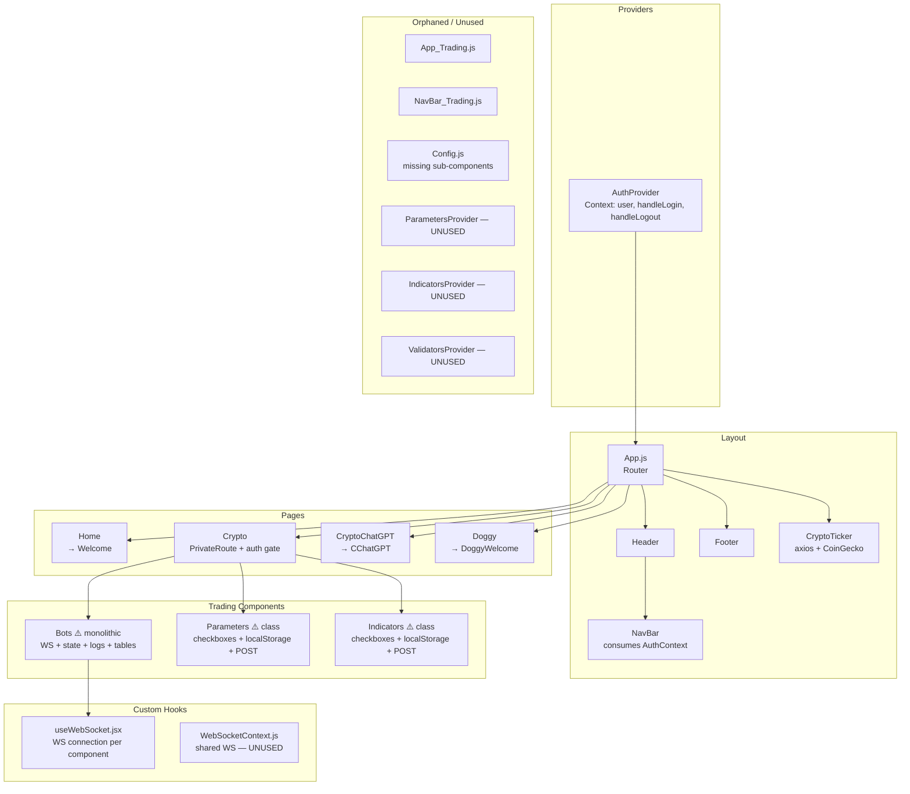

# sonarftweb — UI Component Design & Reusability

**Prompt:** 04-ui-component-design  
**Category:** Components & UI  
**Date:** July 2025  
**Depends on:** [docs/architecture/structure.md](../architecture/structure.md)

---

## Executive Summary

sonarftweb has 18 components across 14 files. The component design is functional but inconsistent: the codebase mixes class and functional components, has no reusable primitive library (no shared Button, Checkbox, Table, or Input components), duplicates nearly identical logic between `Parameters.js` and `Indicators.js`, and places all trading concerns inside a single monolithic `Bots.js`. The styling system is well-structured with CSS custom properties, but CSS class names are duplicated across files and some global styles conflict. There are no PropTypes, no TypeScript, no Storybook, and only one broken test. The foundation is solid enough to refactor incrementally — the CSS variable system and the `utils/api.js` separation are good starting points.

---

## 1. Component Inventory

| Component | Location | Type | Purpose | Reused? | ~Lines | Complexity |
|---|---|---|---|---|---|---|
| App | `src/App.js` | Container | Root router + auth wrapper | No | 30 | Simple |
| App_Trading | `src/App_Trading.js` | Container | Alternate root router (unused) | No | 30 | Simple |
| AuthProvider | `hooks/AuthProvider.js` | Context Provider | Netlify Identity auth state | Yes (root) | 45 | Simple |
| NavBar | `NavBar/NavBar.js` | Presentational + Context | Navigation links + auth buttons | Yes (via Header) | 50 | Simple |
| NavBar_Trading | `NavBar/NavBar_Trading.js` | Presentational + Context | Alternate nav (orphaned) | No | 50 | Simple |
| Header | `Header/Header.js` | Presentational | Wraps NavBar | Yes (App.js) | 10 | Simple |
| Footer | `Footer/Footer.js` | Presentational | Copyright text | Yes (App.js) | 8 | Simple |
| CryptoTicker | `CryptoTicker/CryptoTicker.js` | Container | Scrolling price banner (CoinGecko) | Yes (App.js) | 55 | Medium |
| Home | `pages/Home/Home.js` | Presentational | Landing page shell | No | 15 | Simple |
| Welcome | `pages/Home/Welcome/Welcome.js` | Presentational | Hero text | No | 15 | Simple |
| Crypto | `pages/Crypto/Crypto.js` | Container | Trading page, auth gate | No | 25 | Simple |
| Bots | `components/Bots/Bots.js` | Container (monolithic) | Bot lifecycle, WS, logs, history tables | No | ~200 | Complex |
| Parameters | `components/Parameters/Parameters.js` | Container (class) | Exchange/symbol checkbox config | No | ~130 | Medium |
| Indicators | `components/Indicators/Indicators.js` | Container (class) | Indicator checkbox config | No | ~140 | Medium |
| Config | `components/Config/Config.js` | Container (class, orphaned) | Legacy config panel | No | ~90 | Medium |
| CChatGPT | `components/CChatGPT/CChatGPT.js` | Container | Single-coin price display | Yes (CryptoChatGPT page) | 50 | Simple |
| Building | `components/Building/Building.js` | Presentational | "Under construction" placeholder | Yes (Dex, Forex, Token) | 12 | Simple |
| DoggyWelcome | `components/DoggyWelcome/DoggyWelcome.js` | Presentational | Doggy page content | No | ~15 | Simple |

---

## 2. Presentational vs Container Pattern

### Container Components (logic + data)

| Component | What Logic It Contains |
|---|---|
| `Bots.js` | WebSocket lifecycle, bot state machine, REST fetches, message parsing, log accumulation |
| `Parameters.js` | 3-tier data loading, localStorage sync, server POST |
| `Indicators.js` | 3-tier data loading, localStorage sync, server POST |
| `CryptoTicker.js` | CoinGecko API polling, interval management |
| `CChatGPT.js` | CoinGecko API polling, interval management |
| `Crypto.js` | Auth gate logic (PrivateRoute) |
| `AuthProvider.js` | Netlify Identity event wiring |

### Presentational Components (render only)

| Component | Notes |
|---|---|
| `Header.js` | Pure wrapper — just renders `<NavBar />` |
| `Footer.js` | Static text only |
| `Welcome.js` | Static text only |
| `Building.js` | Static placeholder |
| `NavBar.js` | Reads from `AuthContext` — technically a context consumer, but no local logic |

### Assessment

The pattern is partially applied but not consistently. `Bots.js` is the clearest violation — it is simultaneously a WebSocket manager, a state machine, a data fetcher, and a view renderer. `Parameters.js` and `Indicators.js` mix data loading, persistence, and rendering in class components that cannot be easily split using hooks.

`Header.js` is an unnecessary wrapper — it adds a `<div className="header">` around `<NavBar />` with no other purpose. The header styling could live in `NavBar.js` directly.

---

## 3. Component Responsibility Analysis

### Bots.js — Single Responsibility Violations

`Bots.js` has at least 5 distinct responsibilities:

1. WebSocket connection management (open, close, reconnect)
2. Bot lifecycle state machine (CREATED / REMOVED)
3. Real-time log streaming and display
4. Order and trade history fetching and display
5. Bot selector UI (create, select, remove)

**Recommended split:**

```
Bots.js (orchestrator)
  ├── useBots(clientId) — custom hook: WS + state machine + fetches
  ├── BotControls — create/select/remove buttons
  ├── BotConsole — log <pre> display
  ├── OrderHistoryTable — order table
  └── TradeHistoryTable — trade table
```

### Parameters.js and Indicators.js — Near-Duplicate Code

These two class components share an identical structure:

| Aspect | Parameters.js | Indicators.js |
|---|---|---|
| Constructor | localStorage hydration | localStorage hydration |
| `componentDidMount` | 3-tier fetch chain | 3-tier fetch chain |
| `handleCheckboxChange` | setState + localStorage write | setState + localStorage write |
| `handleSetClick` | POST to server | POST to server |
| `renderCheckboxes` | Renders `<li><label><input>` | Renders `<li><label><input>` |
| State shape | `{ exchanges, symbols }` | `{ periods, oscillators, movingaverages }` |

The only differences are the state keys, the API functions called, and the localStorage key. This is a textbook case for a shared `ConfigCheckboxPanel` component or a `useConfigCheckboxes` hook.

### Config.js — Orphaned and Incomplete

`Config.js` imports `SetParameters`, `ParametersList`, `AddIndicators`, `IndicatorsList`, `AddValidators`, `ValidatorsList` — none of which appear in the directory listing under `components/Config/`. The sub-component directories exist (`AddIndicators/`, `AddValidators/`, `Indicators/`, `IndicatorsList/`, `Validators/`, `ValidatorsList/`) but their JS files were not found. `Config.js` is not routed in either `App.js` or `App_Trading.js`. This component is dead code.

---

## 4. Props Design & Interface

### Key Component Props

| Component | Prop | Required? | Type | Purpose | Documented? |
|---|---|---|---|---|---|
| `Bots` | `user` | Yes | object | Netlify user object; only `user.id` is used | No |
| `Parameters` | `clientId` | Yes | string | Netlify user UUID for API calls | No |
| `Indicators` | `clientId` | Yes | string | Netlify user UUID for API calls | No |
| `Config` | `user` | Yes | object | Passed but component is orphaned | No |
| `PrivateRoute` (inline) | `children` | Yes | ReactNode | Protected content | No |
| `PrivateRoute` (inline) | `value` | Yes | any | Truthy = render children | No |

### Issues

- **No PropTypes anywhere.** Not a single component defines PropTypes. Passing wrong types fails silently.
- **No TypeScript.** No interface or type definitions.
- **`Bots` receives `user` but only uses `user.id`.** Should receive `clientId` directly, consistent with `Parameters` and `Indicators`.
- **`PrivateRoute` is redefined in every page file** (`Crypto.js`, `Dex.js`, `Forex.js`, `Token.js`) as an identical inline function. It should be a single shared component.
- **No default props.** If a required prop is missing, components fail silently or crash.

### PrivateRoute Duplication

```js
// Defined identically in Crypto.js, Dex.js, Forex.js, Token.js
function PrivateRoute({ children, value }) {
    return value ? children : <Navigate to="/" />;
}
```

This should be extracted once to `src/components/PrivateRoute.js` and imported everywhere.

---

## 5. Composition Patterns

| Pattern | Used? | Where |
|---|---|---|
| Higher-Order Components (HOC) | No | Not used |
| Render Props | No | Not used |
| Custom Hooks | Partially | `useWebSocket.jsx` (used), `WebSocketContext.js` (unused) |
| Children / Slot pattern | Yes | `AuthProvider`, `ParametersProvider`, all context providers |
| Compound components | No | Not used |
| Composition over inheritance | Yes | All components use composition; no class inheritance chains |

The composition approach is correct — no inheritance chains exist. However, the custom hook ecosystem is underdeveloped. The only active custom hook is `useWebSocket.jsx`, and it is used by exactly one component (`Bots.js`). The more sophisticated `WebSocketContext.js` hook/provider was built but never integrated.

---

## 6. Custom Hooks

| Hook | File | Purpose | Used By | Side Effects | Cleanup |
|---|---|---|---|---|---|
| `useWebSocket` | `hooks/useWebSocket.jsx` | Opens a WebSocket, returns `{ socket, wsOpen }`, auto-reconnects | `Bots.js` | WebSocket connection, `setInterval`-like reconnect | Closes socket on unmount ⚠️ (see below) |
| `useWebSocket` (context) | `hooks/WebSocketContext.js` | Shared singleton WS with listener registry | **Nobody** | WebSocket connection | Closes socket on unmount ✓ |
| `AuthProvider` / `useContext(AuthContext)` | `hooks/AuthProvider.js` | Netlify Identity auth state | `NavBar`, `Crypto`, `Dex`, `Forex`, `Token` | Netlify Identity init, event listeners | Removes event listeners on unmount ✓ |

### useWebSocket.jsx — Cleanup Issue

The auto-reconnect logic in `useWebSocket.jsx` has a subtle memory leak:

```js
const connect = () => {
    const ws = new WebSocket(url);
    ws.onclose = () => {
        setWsOpen(false);
        setSocket(null);
        if (autoReconnect) {
            connect(); // recursive — creates new socket immediately
        }
    };
};

// Cleanup:
return () => {
    setWsOpen(false);
    setSocket((currentSocket) => {
        if (currentSocket) currentSocket.close(); // triggers onclose → connect() again
        return null;
    });
};
```

When the component unmounts, `currentSocket.close()` fires `onclose`, which calls `connect()` again because `autoReconnect` is still `true` in the closure. The new socket is created after unmount, leaking a connection. The fix is to use a ref flag:

```js
const shouldReconnect = useRef(true);

// In cleanup:
return () => {
    shouldReconnect.current = false;
    // ...close socket
};

// In onclose:
if (autoReconnect && shouldReconnect.current) connect();
```

---

## 7. Styling Approach

### System Overview

| Layer | File | Purpose |
|---|---|---|
| CSS Reset | `src/reset.css` | Zero margin/padding/box-sizing |
| Design Tokens | `src/variables.css` | CSS custom properties (colors, etc.) |
| Global Base | `src/index.css` | Body font, background, code font |
| App Layout | `src/styles.css` | `.App`, `.main-container`, responsive typography |
| Component CSS | `components/*/[name].css` | Per-component scoped styles |
| Page CSS | `pages/*/[name].css` | Per-page layout styles |

### Design Token System

`variables.css` defines a coherent set of CSS custom properties:

```css
:root {
  --backgroundPrimary: #000814;
  --backgroundSecondary: #0c2a4e;
  --backgroundTertiary: #e0e0e0;
  --textPrimary: #dae1e7;
  --textSecondary: #142850;
  --borderPrimary: #528afc;
  --buttonBackground: #75a0fc;
  --buttonText: #000814;
  --buttonHoverBackground: #6897fc;
  --buttonHoverText: #142850;
  --headerSpan: #548cfe;
  --footerSpan: #548cfe;
}
```

This is a solid foundation. All component CSS files reference these variables correctly.

**Issue:** `variables.css` contains 5 additional `:root_` and `:root__` blocks (note the trailing underscores) — these are inactive theme variants that were never implemented as a proper theme-switching system. They are dead CSS that adds confusion.

**Issue:** `--textTerciary` is defined in `variables.css` but `footer.css` references `--backgroundTerciary` (note the different spelling — `Terciary` vs `Tertiary`). This is a typo that causes the footer background to fall back to the browser default.

### CSS Class Name Conflicts

`.checkbox-group` is defined in both `parameters.css` and `indicators.css` with different styles:

```css
/* parameters.css */
.checkbox-group {
    width: fit-content;
    display: flex;
    flex-wrap: wrap;
    gap: 5px;
}

/* indicators.css */
.checkbox-group {
    width: fit-content;
    display: flex;
    flex-wrap: wrap;
    gap: 5px;
    margin-bottom: 10px;
    padding: 10px;
    border-radius: 5px;
    border: 1px solid var(--borderPrimary);
}
```

Since CRA does not scope CSS by default, whichever file is imported last wins globally. This is a latent styling bug.

`.bots-container` is defined in both `bots.css` and `crypto.css` with different `flex-direction` values. The page-level `crypto.css` definition overrides the component-level `bots.css` definition.

### Responsive Design

`styles.css` and `navbar.css` both implement responsive breakpoints:

| Breakpoint | Range | Approach |
|---|---|---|
| Mobile | 360–639px | Font size reduction |
| Mobile+ | 375–666px, 412–731px | Overlapping ranges (redundant) |
| Tablet | 768–1023px | Font size increase |
| Desktop | 1024–1365px, 1366–1919px | Font size scaling |
| Large Desktop | 1920–2559px, 2560px+ | Large font sizes |

The overlapping mobile breakpoints (360–639, 375–666, 412–731) create unpredictable cascading behavior on devices that fall in multiple ranges simultaneously.

The trading tables in `Bots.js` (13-column order/trade history) have no responsive handling — they will overflow on mobile and tablet screens.

### Dark Mode

Not implemented. The design is dark-themed by default (dark backgrounds, light text) but there is no `prefers-color-scheme` media query or theme toggle.

---

## 8. Reusable Component Library

No shared primitive component library exists. Every component builds its own UI from scratch using raw HTML elements.

### Missing Primitives

| Primitive | Currently | Impact |
|---|---|---|
| `<Button>` | Raw `<button>` with inline styles in each component | Button styles duplicated across `crypto.css`, `parameters.css`, `indicators.css`, `navbar.css` |
| `<Checkbox>` | Raw `<input type="checkbox">` in `Parameters` and `Indicators` | Identical markup duplicated |
| `<DataTable>` | Raw `<table>` with identical structure in `Bots.js` (twice) | Order and trade tables are copy-paste duplicates |
| `<LoadingSpinner>` | `<div>Loading...</div>` in `Bots.js` only | No consistent loading UI |
| `<ErrorMessage>` | Not present anywhere | No error feedback to users |
| `<PrivateRoute>` | Inline function in 4 page files | Identical code in 4 places |

### Duplicate Table Structure

The order history table and trade history table in `Bots.js` are structurally identical — same 13 columns, same cell rendering pattern, different data source. They should be a single `<TradeHistoryTable data={...} />` component.

---

## 9. Component Lifecycle & Hooks

### useEffect Usage

| Component | useEffect | Dependencies | Cleanup | Issue |
|---|---|---|---|---|
| `Bots.js` | Fetch bot IDs on mount | `[clientId]` | None | No AbortController |
| `Bots.js` | Register `onmessage` | `[clientId, wsOpen, socket, botIds, selectedBotId]` | None | Re-registers on every botIds change |
| `Bots.js` | Auto-scroll logs | `[logs]` | None | Fine |
| `useWebSocket.jsx` | Open WebSocket | `[url, autoReconnect]` | Closes socket | Reconnect fires after unmount (see §6) |
| `useWebSocket.jsx` | Log readyState | `[socket]` | None | Debug-only; should be removed in production |
| `AuthProvider.js` | Init Netlify Identity | `[]` | Removes event listeners | Correct ✓ |
| `CryptoTicker.js` | Fetch + poll CoinGecko | `[]` | Clears interval | Correct ✓ |
| `CChatGPT.js` | Fetch + poll CoinGecko | `[]` | Clears interval | Correct ✓ |
| `WebSocketContext.js` | Open shared WS | `[]` | Closes socket | Correct ✓ (but unused) |

### useRef Usage

| Component | Ref | Purpose | Appropriate? |
|---|---|---|---|
| `Bots.js` | `consoleEndRef` | Scroll anchor for log `<pre>` | Yes ✓ |
| `WebSocketContext.js` | `wsOpen` | Connection status flag | Questionable — `wsOpen.current` changes don't trigger re-renders, so consumers can't react to connection state changes |
| `WebSocketContext.js` | `listeners` | Message listener registry | Yes ✓ — mutable registry doesn't need to trigger renders |

### useCallback / useMemo

Neither `useCallback` nor `useMemo` is used anywhere in the codebase. At current scale this is not a performance problem, but `AuthProvider`'s context value and `Bots.js`'s event handlers would benefit from memoization.

---

## 10. Form Components

The app uses forms in `Parameters.js` and `Indicators.js` only.

| Aspect | Implementation | Assessment |
|---|---|---|
| Form element | `<form>` wrapping checkboxes | Correct semantic HTML |
| Input type | `<input type="checkbox">` | Controlled inputs via `checked={options[item]}` |
| Submit | `<button type="button">` with `onClick` | Bypasses native form submission — correct for async POST |
| Validation | None | No client-side validation before POST |
| Error display | None | POST failures logged to console only |
| Form state | Class `this.state` | Works but cannot use hooks |
| Reusable inputs | None | Each checkbox is rendered inline |

The checkbox rendering pattern is identical in both components:

```js
// Parameters.js and Indicators.js — identical pattern
renderCheckboxes(category) {
    const options = this.state[category];
    return Object.keys(options).map((item) => (
        <li key={item}>
            <label>
                <input
                    type="checkbox"
                    name={item}
                    checked={options[item] || false}
                    onChange={(e) => this.handleCheckboxChange(e, category)}
                />
                {item}
            </label>
        </li>
    ));
}
```

This should be a shared `<CheckboxGroup category={...} options={...} onChange={...} />` component.

---

## 11. Testing & Documentation

| Aspect | Status |
|---|---|
| Unit tests | Only `App.test.js` exists — and it is broken (tests for "learn react" text that doesn't exist) |
| Snapshot tests | None |
| Component tests | None |
| Hook tests | None |
| Mock data | None |
| Storybook | Not present |
| JSDoc / comments | Minimal — a few inline comments in `Bots.js` and `Parameters.js` |
| PropTypes | None |
| README per component | None |

The test suite is effectively empty. The single existing test will fail on `npm test`.

---

## 12. Code Quality Issues

| Issue | Severity | Location | Detail |
|---|---|---|---|
| `Bots.js` is monolithic (~200 lines, 5 responsibilities) | High | `Bots.js` | Split into hook + sub-components |
| `Parameters.js` and `Indicators.js` are near-duplicates | High | Both files | Extract shared `useConfigCheckboxes` hook |
| `PrivateRoute` defined 4 times identically | Medium | `Crypto.js`, `Dex.js`, `Forex.js`, `Token.js` | Extract to shared component |
| Order and trade tables are copy-paste duplicates | Medium | `Bots.js` | Extract `<TradeHistoryTable>` component |
| No PropTypes or TypeScript | Medium | All components | Add PropTypes at minimum |
| `.checkbox-group` CSS class conflict | Medium | `parameters.css`, `indicators.css` | Rename to `.parameters-checkbox-group` / `.indicators-checkbox-group` |
| `.bots-container` CSS class conflict | Medium | `bots.css`, `crypto.css` | Consolidate or rename |
| `variables.css` has 5 dead `:root_` theme blocks | Low | `variables.css` | Remove or implement as proper theme system |
| `--backgroundTerciary` typo in `footer.css` | Low | `footer.css` | Fix to `--backgroundTertiary` |
| `useWebSocket.jsx` reconnect fires after unmount | Medium | `useWebSocket.jsx` | Add `shouldReconnect` ref guard |
| `Config.js` imports missing sub-components | High | `Config.js` | Remove or complete |
| `NavBar_Trading.js` is orphaned | Low | `NavBar_Trading.js` | Wire into `App_Trading.js` or remove |
| `App_Trading.js` is a parallel entry point never used | Medium | `App_Trading.js` | Merge routes or remove |
| No loading/error states in `Parameters` or `Indicators` | Medium | Both files | Add loading + error UI |
| Overlapping mobile breakpoints in `styles.css` | Low | `styles.css` | Consolidate to non-overlapping ranges |
| Trading tables have no responsive CSS | Medium | `bots.css` | Add horizontal scroll or card layout for mobile |
| `useWebSocket.jsx` second `useEffect` logs readyState | Low | `useWebSocket.jsx` | Remove debug logging from production code |

---

## 13. Component Architecture Diagram



---

## Summary of Recommendations by Priority

| Priority | Issue | Action |
|---|---|---|
| High | `Bots.js` monolithic | Extract `useBots` hook + `BotControls`, `BotConsole`, `TradeHistoryTable` sub-components |
| High | `Parameters` / `Indicators` near-duplicate class components | Refactor to functional + shared `useConfigCheckboxes(config)` hook |
| High | `Config.js` imports missing files | Remove or complete the sub-components |
| Medium | `PrivateRoute` defined 4 times | Extract to `src/components/PrivateRoute.js` |
| Medium | Order/trade tables duplicated in `Bots.js` | Extract `<TradeHistoryTable data={rows} />` |
| Medium | No PropTypes anywhere | Add PropTypes to all components with props |
| Medium | `.checkbox-group` and `.bots-container` CSS conflicts | Rename conflicting classes to be component-scoped |
| Medium | `useWebSocket.jsx` reconnect after unmount | Add `shouldReconnect` ref guard |
| Medium | Trading tables not responsive | Add `overflow-x: auto` wrapper or card layout |
| Low | Dead `:root_` theme blocks in `variables.css` | Remove or implement as proper theme toggle |
| Low | `--backgroundTerciary` typo in `footer.css` | Fix spelling to `--backgroundTertiary` |
| Low | `App_Trading.js` / `NavBar_Trading.js` orphaned | Decide: merge into `App.js` or remove |
| Low | Debug `console.log` in `useWebSocket.jsx` | Remove readyState logging from production |

---

**Save location:** `docs/components/design-patterns.md`  
**Next prompts:** `05-real-time-updates.md`, `08-performance-optimization.md`, `09-testing-quality.md`
