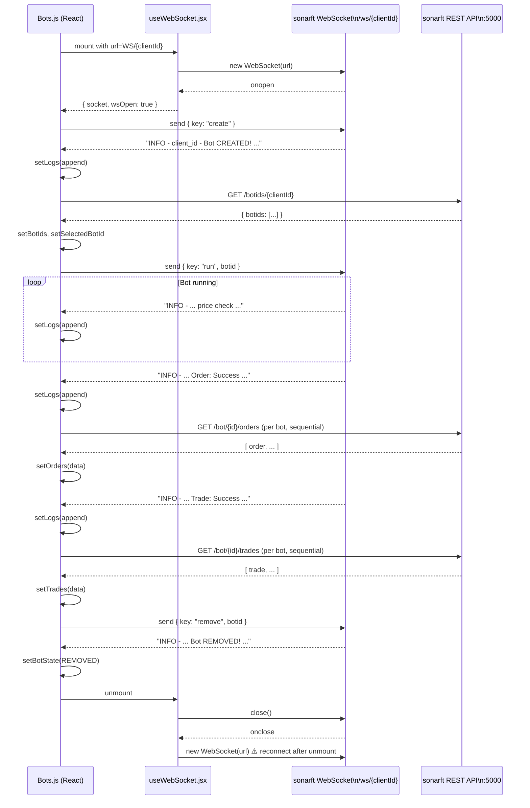

# sonarftweb — Real-time Updates & WebSocket Integration

**Prompt:** 05-real-time-updates  
**Category:** Real-time Communication  
**Date:** July 2025  
**Depends on:** [docs/api-integration/sonarft-integration.md](../api-integration/sonarft-integration.md), [docs/state-management/data-flow.md](../state-management/data-flow.md)

---

## Executive Summary

sonarftweb uses two independent, competing WebSocket implementations that coexist without coordination. The active one (`useWebSocket.jsx`) creates a per-component connection with auto-reconnect, but has a confirmed memory leak where closing the socket on unmount triggers an immediate reconnect. The unused one (`WebSocketContext.js`) is architecturally superior — a shared singleton with a listener registry — but was never integrated. The event handling model is entirely text-based: the client scans raw log strings for sentinel substrings to detect bot lifecycle events, which is fragile and tightly coupled to the server's log format. There is no authentication on the WebSocket connection, no structured message protocol, no backoff strategy, no error handling for connection failures, and no user feedback when the connection is lost. The real-time system works in the happy path but is not production-resilient.

---

## 1. WebSocket Architecture

| Aspect | Implementation |
|---|---|
| Library | Native browser `WebSocket` API — no Socket.io or third-party library |
| Active implementation | `hooks/useWebSocket.jsx` — custom hook, per-component connection |
| Unused implementation | `hooks/WebSocketContext.js` — context-based shared singleton |
| Endpoint | `ws://localhost:5000/ws/{clientId}` (hardcoded in `constants.js`) |
| Authentication | None — no token, no handshake credential |
| Environment config | Hardcoded — no `REACT_APP_WS_URL` env var |
| Connection pattern | One connection per `Bots` component instance |
| Protocol | Plain text — no subprotocol negotiation |

### Two Implementations Side by Side

```
hooks/useWebSocket.jsx          hooks/WebSocketContext.js
─────────────────────────       ─────────────────────────
Per-component connection        Shared singleton connection
Returns { socket, wsOpen }      Provides { ws, wsOpen, addListener, removeListener }
Auto-reconnect (recursive)      No auto-reconnect
Used by: Bots.js                Used by: nobody
URL passed as parameter         URL hardcoded to ws://localhost:5000
```

`WebSocketContext.js` connects to `ws://localhost:5000` (no path, no `clientId`) while `useWebSocket.jsx` connects to `ws://localhost:5000/ws/{clientId}`. These are different endpoints — the context version would not work with the sonarft backend's per-client WebSocket routing even if it were mounted.

---

## 2. Connection Lifecycle

### useWebSocket.jsx — Active Implementation

```
Component mounts
  └── useEffect([url, autoReconnect])
        └── connect()
              └── new WebSocket(url)
                    ├── onopen  → setWsOpen(true), setSocket(ws)
                    └── onclose → setWsOpen(false), setSocket(null)
                                  → if autoReconnect: connect()  ⚠️ immediate, no delay

Component unmounts
  └── cleanup function
        └── setWsOpen(false)
        └── setSocket(currentSocket => {
                currentSocket.close()  ← triggers onclose → connect() again ⚠️
                return null
            })
```

### Memory Leak — Confirmed

The cleanup function calls `currentSocket.close()`, which fires `ws.onclose`. At that point `autoReconnect` is still `true` in the closure, so `connect()` is called again — creating a new `WebSocket` after the component has unmounted. This orphaned socket:

1. Holds an open TCP connection to the sonarft server
2. Has no reference in React state (component is gone)
3. Cannot be closed by any subsequent cleanup
4. Will attempt to reconnect again if the server closes it

**Fix:**

```js
const shouldReconnect = useRef(true);

useEffect(() => {
    shouldReconnect.current = true;

    const connect = () => {
        const ws = new WebSocket(url);
        ws.onopen = () => { setWsOpen(true); setSocket(ws); };
        ws.onclose = () => {
            setWsOpen(false);
            setSocket(null);
            if (autoReconnect && shouldReconnect.current) {
                setTimeout(connect, 2000); // backoff delay
            }
        };
    };

    connect();

    return () => {
        shouldReconnect.current = false;
        setSocket(currentSocket => {
            if (currentSocket) currentSocket.close();
            return null;
        });
    };
}, [url, autoReconnect]);
```

### Reconnection Strategy

| Aspect | Current | Recommended |
|---|---|---|
| Reconnect trigger | Immediate on `onclose` | Delayed with exponential backoff |
| Backoff | None — reconnects instantly | `min(delay * 2, maxDelay)` — e.g. 1s, 2s, 4s, 8s, 30s cap |
| Max retries | Infinite | Cap at N retries or let user manually reconnect |
| User notification | None | Show "Disconnected — reconnecting..." banner |
| Jitter | None | Add random jitter to prevent thundering herd |

Immediate reconnect on close means if the sonarft server restarts, the client hammers it with reconnection attempts at maximum speed.

### WebSocketContext.js — Unused Implementation

This implementation is architecturally cleaner:

```js
// Correct pattern: shared singleton, listener registry
const addListener = (id, func) => { listeners.current[id] = func; };
const removeListener = (id) => { delete listeners.current[id]; };

ws.onmessage = (msg) => {
    Object.values(listeners.current).forEach(listener => listener(msg));
};
```

Multiple components could subscribe to the same connection without each opening their own socket. However, it has its own issues:
- URL hardcoded to `ws://localhost:5000` (missing `/ws/{clientId}` path)
- No auto-reconnect
- `wsOpen` stored as a `ref` — consumers cannot react to connection state changes since ref mutations don't trigger re-renders

---

## 3. WebSocket Events

### Outbound (Client → Server)

| Action | Message Structure | Trigger |
|---|---|---|
| Create bot | `{ type: "keypress", key: "create" }` | "Create New Bot" button click |
| Run bot | `{ type: "keypress", key: "run", botid: string }` | Auto-sent after BOT_CREATED received |
| Remove bot | `{ type: "keypress", key: "remove", botid: string }` | "Remove Bot" button click |

### Inbound (Server → Client)

The server sends plain text log strings. The client detects events by scanning for substrings:

| Detection Pattern | `event.data.includes(...)` | Handler Action | State Updated |
|---|---|---|---|
| Always (every message) | — | Append to log string | `logs` |
| `"Bot CREATED!"` | `BOT_CREATED_MESSAGE` | Fetch bot IDs, auto-run bot | `botIds`, `selectedBotId`, `botState` |
| `"Bot REMOVED!"` | `BOT_REMOVED_MESSAGE` | Update bot state | `botState` |
| `"Order: Success"` | `ORDER_SUCCESS` | Fetch all orders | `orders` |
| `"Trade: Success"` | `TRADE_SUCCESS` | Fetch all trades | `trades` |

### Message Protocol Assessment

The current protocol is **text-based log streaming with substring detection**. This is the weakest possible protocol design:

| Problem | Impact |
|---|---|
| Server log format change breaks client silently | Any refactor of sonarft log messages stops events from firing |
| No message type field | Cannot distinguish event types without string scanning |
| No message ID | Cannot deduplicate or acknowledge messages |
| No timestamp | Cannot order events or detect stale messages |
| No schema | No validation possible |
| Partial match risk | A log line containing "Bot CREATED!" as part of a longer message (e.g., error context) would trigger bot creation logic |

**Recommended protocol — structured JSON:**

```json
// Server → Client
{ "type": "bot_created", "botid": "bot_abc123", "timestamp": 1720000000 }
{ "type": "bot_removed", "botid": "bot_abc123", "timestamp": 1720000001 }
{ "type": "order_success", "botid": "bot_abc123", "timestamp": 1720000002 }
{ "type": "trade_success", "botid": "bot_abc123", "timestamp": 1720000003 }
{ "type": "log", "level": "INFO", "message": "...", "timestamp": 1720000004 }
```

```js
// Client handler
ws.onmessage = (event) => {
    try {
        const msg = JSON.parse(event.data);
        switch (msg.type) {
            case 'log': appendLog(msg.message); break;
            case 'bot_created': handleBotCreated(msg.botid); break;
            case 'bot_removed': handleBotRemoved(msg.botid); break;
            case 'order_success': refreshOrders(); break;
            case 'trade_success': refreshTrades(); break;
        }
    } catch {
        // Plain text fallback for legacy messages
        appendLog(event.data);
    }
};
```

---

## 4. Real-time Data Integration

### Data Parsing

```js
// Current — no parsing, raw string appended
socket.onmessage = async (event) => {
    setLogs((logs) => logs + "\n" + event.data);  // raw string concat
    if (event.data.includes(BOT_CREATED_MESSAGE)) { ... }
};
```

No JSON parsing, no schema validation, no type checking. `event.data` is always treated as a plain string.

### Merging Real-time with REST Data

The app uses a **REST-on-event** pattern: WebSocket messages trigger REST fetches rather than carrying the data themselves.

```
WS: "Order: Success"  →  REST GET /bot/{id}/orders  →  setOrders(data)
WS: "Trade: Success"  →  REST GET /bot/{id}/trades  →  setTrades(data)
WS: "Bot CREATED!"    →  REST GET /botids/{clientId} →  setBotIds(data)
```

This is a valid pattern (avoids duplicating data in WS messages) but introduces latency: the user sees the "Order: Success" log line before the table updates, because the REST fetch must complete first.

### Race Conditions

**Scenario 1 — Rapid order fills:**
```
t=0: WS "Order: Success" → fetchAllOrders() starts (call A)
t=1: WS "Order: Success" → fetchAllOrders() starts (call B)
t=2: call B completes → setOrders(data_B)
t=3: call A completes → setOrders(data_A)  ← overwrites B with stale data
```
Call A started first but finished last. The orders table now shows stale data. No `AbortController` or sequence number prevents this.

**Scenario 2 — Bot creation + immediate order:**
```
t=0: WS "Bot CREATED!" → getBotIds() starts
t=1: WS "Order: Success" → fetchAllOrders(botIds) — botIds is STALE (new bot not yet in array)
t=2: getBotIds() completes → setBotIds([...newBot])
```
The order fetch uses the pre-creation `botIds` array, missing the new bot's orders.

**Scenario 3 — Stale closure:**
The `onmessage` handler captures `botIds` from the closure at effect registration time. Between effect re-runs, `botIds` in the handler may not include recently added bots.

### Deduplication

No deduplication exists. Identical consecutive messages (e.g., two `"Order: Success"` lines) trigger two identical REST fetches with no guard.

---

## 5. Error Handling & Resilience

| Scenario | Current Handling | Severity |
|---|---|---|
| WebSocket connection refused (server down) | `onclose` fires → immediate reconnect loop | High |
| WebSocket error event | Not handled — no `ws.onerror` handler | High |
| Malformed message | No try/catch around message handling | Medium |
| Server sends unexpected message format | Silently ignored (no matching substring) | Low |
| Connection lost mid-session | `onclose` → reconnect, but no user notification | High |
| REST fetch fails after WS trigger | `console.log` only, no user feedback | Medium |

### Missing `onerror` Handler

```js
// useWebSocket.jsx — current
ws.onopen = () => { ... };
ws.onclose = () => { ... };
// ws.onerror is never set
```

WebSocket errors (e.g., connection refused, TLS failure) fire `onerror` before `onclose`. Without an `onerror` handler, these errors are silently swallowed. The browser console will show an unhandled error, but the app has no awareness of it.

**Fix:**
```js
ws.onerror = (error) => {
    console.error("WebSocket error:", error);
    setWsError("Connection error — check server status");
};
```

### Graceful Degradation

The app has no degraded mode. If the WebSocket connection cannot be established:
- The "Create New Bot" button sends to a null socket (guarded by `if (socket)` check — correct)
- The bot console shows nothing
- No message tells the user the connection is down
- The `isLoading` spinner in `Bots.js` clears after `getBotIds` completes, regardless of WS state

The `wsOpen` state is available in `Bots.js` but is only used to gate `onmessage` registration — it is never used to show a connection status indicator to the user.

---

## 6. Performance

### Message Frequency

The sonarft server streams log output from the trading bot in real time. During active trading, this could be multiple messages per second (price checks, indicator calculations, trade evaluations). There is no throttling or batching on the client side.

### Log String Growth

```js
setLogs((logs) => logs + "\n" + event.data);
```

Every message appends to a single string. For a bot running for hours:
- 1 message/second × 3600 seconds = 3,600 log lines
- Each line ~100 chars = ~360KB string in memory
- React re-renders the entire `<pre>` on every append
- `consoleEndRef.scrollIntoView()` fires on every render

At high message frequency this becomes a significant performance bottleneck. The `<pre>` element re-renders with the full string on every single message.

**Fix — capped array with virtualization:**
```js
const MAX_LOG_LINES = 500;
const [logs, setLogs] = useState([]);

// In onmessage:
setLogs(prev => {
    const next = [...prev, event.data];
    return next.length > MAX_LOG_LINES ? next.slice(-MAX_LOG_LINES) : next;
});

// In render:
<pre className="console">
    {logs.join('\n')}
    <div ref={consoleEndRef} />
</pre>
```

### REST Fetches Triggered by WebSocket

Each `"Order: Success"` message triggers `fetchAllOrders(botIds)` which makes one REST call per bot ID sequentially. With N bots, one trade event causes N sequential HTTP requests. This scales poorly.

### UI Re-renders from WebSocket

Every WebSocket message causes:
1. `setLogs` → re-render of `Bots.js` → re-render of `<pre>` with full log string
2. `consoleEndRef.scrollIntoView()` → layout recalculation

With high-frequency messages, this creates a render loop that can degrade UI responsiveness.

---

## 7. Testing & Mocking

| Aspect | Status |
|---|---|
| WebSocket mock | Not present |
| Connection scenario tests | None |
| Event simulation | None |
| Mock server | None |
| Test utilities | None |

There is no infrastructure for testing WebSocket behavior. The only test file (`App.test.js`) is broken and tests nothing related to WebSocket. To test `Bots.js` properly, a WebSocket mock would be needed:

```js
// Example mock setup with jest
global.WebSocket = jest.fn().mockImplementation((url) => ({
    send: jest.fn(),
    close: jest.fn(),
    onopen: null,
    onclose: null,
    onmessage: null,
    onerror: null,
    readyState: WebSocket.OPEN,
}));

// Simulate a message
const wsInstance = WebSocket.mock.instances[0];
wsInstance.onmessage({ data: "Bot CREATED!" });
```

---

## 8. Real-time Features

### Bot Log Streaming

- **Events used:** Every inbound WS message
- **Data flow:** `event.data` → appended to `logs` string → rendered in `<pre>`
- **Purpose:** Shows the bot's operational output in real time
- **Issues:** Unbounded growth, full re-render on every message, no log levels, no filtering

### Bot Lifecycle Notifications

- **Events used:** Messages containing `"Bot CREATED!"`, `"Bot REMOVED!"`
- **Data flow:** String match → REST fetch → state update → UI refresh
- **Purpose:** Keeps bot selector and state in sync with server
- **Issues:** Fragile string matching, REST latency between event and UI update

### Order Fill Notifications

- **Events used:** Messages containing `"Order: Success"`
- **Data flow:** String match → sequential REST fetches per bot → `setOrders`
- **Purpose:** Refreshes order history table after a fill
- **Issues:** Race condition with concurrent fills, sequential fetches, no deduplication

### Trade Completion Notifications

- **Events used:** Messages containing `"Trade: Success"`
- **Data flow:** String match → sequential REST fetches per bot → `setTrades`
- **Purpose:** Refreshes trade history table after a completed trade
- **Issues:** Same as order fills

### Missing Real-time Features

| Feature | Status | Notes |
|---|---|---|
| Live price display | ⚠️ Not Found in Source Code | Only CoinGecko polling (3-min interval), no live exchange prices |
| Bot health / status indicator | ⚠️ Not Found in Source Code | No visual indicator of bot running/stopped state |
| Connection status indicator | ⚠️ Not Found in Source Code | `wsOpen` state exists but never shown in UI |
| Error notifications | ⚠️ Not Found in Source Code | No toast/banner for WS errors |
| Trade P&L in real time | ⚠️ Not Found in Source Code | Only available after REST fetch on "Trade: Success" |

---

## 9. Debugging & Monitoring

| Capability | Status |
|---|---|
| WebSocket message logging | `console.log` for open/close/readyState in `useWebSocket.jsx` |
| Message content logging | Not logged (only appended to UI) |
| Error logging | No `onerror` handler — errors not logged |
| Browser DevTools | Native WS frames visible in Network tab ✓ |
| Connection metrics | None tracked |
| Reconnect attempt counter | None |

The second `useEffect` in `useWebSocket.jsx` logs the socket's `readyState` whenever `socket` changes — this is debug code that should be removed from production:

```js
// useWebSocket.jsx — debug logging that should be removed
useEffect(() => {
    if (socket) {
        switch (socket.readyState) {
            case WebSocket.CONNECTING: console.log("WebSocket is connecting..."); break;
            case WebSocket.OPEN: console.log("WebSocket is open and ready to communicate."); break;
            // ...
        }
    }
}, [socket]);
```

---

## 10. WebSocket vs REST API Comparison

| Aspect | WebSocket (current use) | REST API (current use) |
|---|---|---|
| Purpose | Bot control commands + log streaming | Data reads (bot IDs, history) + config writes |
| Latency | Low — persistent connection | Higher — new TCP connection per request |
| Data direction | Bidirectional | Request/response |
| Authentication | None | None (same gap) |
| Error handling | None | Partial (try/catch in some functions) |
| Justification | Correct — log streaming requires push | Correct — CRUD operations suit REST |

The split between WebSocket (streaming/commands) and REST (data/config) is architecturally sound. The problem is not the choice of protocol but the implementation quality of both.

### Fallback if WebSocket Unavailable

There is no REST polling fallback. If the WebSocket connection cannot be established:
- Bot creation/removal commands cannot be sent
- Log output is not visible
- Order/trade history is not refreshed (no polling alternative)
- The user sees no indication that anything is wrong

---

## 11. Data Consistency

### REST vs WebSocket Sync

The app uses WebSocket events as triggers for REST fetches. This means:

1. WebSocket delivers the notification ("something happened")
2. REST delivers the actual data ("here is what happened")

This two-step pattern is correct in principle but creates a consistency window: between the WS notification and the REST response, the UI shows stale data. For a trading application where order fills happen in milliseconds, this window is acceptable — but it should be acknowledged.

### Conflict Resolution Strategy

There is no explicit conflict resolution. The last REST response to complete wins (`setOrders(data)` overwrites whatever was there). In the race condition scenario described in §4, this means stale data can overwrite fresh data.

A simple fix is to use a request sequence counter:

```js
const fetchSeq = useRef(0);

const refreshOrders = async () => {
    const seq = ++fetchSeq.current;
    const allOrders = await fetchAllOrders(botIds);
    if (seq === fetchSeq.current) {  // only apply if still the latest request
        setOrders(allOrders);
    }
};
```

---

## 12. Scalability

| Concern | Current State | Notes |
|---|---|---|
| Multiple bots | Supported — one WS connection handles all bots for a client | Bot commands include `botid` field |
| Multiple browser tabs | Each tab opens its own WS connection | sonarft routes by `clientId` — same client in two tabs = two connections, both receive same logs |
| High message volume | No throttling or batching | Could overwhelm React's render cycle at high frequency |
| Large order/trade history | No pagination | Full history loaded on every refresh |
| Connection pooling | Not needed client-side | One connection per client is correct |
| Message ordering | Not guaranteed | TCP preserves order within a connection, but REST responses can arrive out of order |

---

## 13. WebSocket Integration Diagram



---

## Summary of Issues by Priority

| Priority | Issue | File | Recommendation |
|---|---|---|---|
| High | Memory leak: reconnect fires after unmount | `useWebSocket.jsx` | Add `shouldReconnect` ref; set to `false` in cleanup |
| High | No `onerror` handler | `useWebSocket.jsx` | Add `ws.onerror` handler with error state |
| High | No user notification on connection loss | `Bots.js` | Show connection status indicator using `wsOpen` |
| High | Fragile text-based event detection | `Bots.js` | Coordinate with sonarft to send structured JSON events |
| High | No authentication on WebSocket connection | `useWebSocket.jsx` | Pass auth token as query param or first message |
| Medium | Immediate reconnect — no backoff | `useWebSocket.jsx` | Implement exponential backoff with jitter |
| Medium | Race condition on concurrent REST fetches | `Bots.js` | Use request sequence counter to discard stale responses |
| Medium | Log string grows unbounded | `Bots.js` | Cap at N lines using array; use `slice(-N)` |
| Medium | No deduplication of WS-triggered fetches | `Bots.js` | Debounce `fetchAllOrders`/`fetchAllTrades` calls |
| Medium | `WebSocketContext.js` wrong endpoint | `WebSocketContext.js` | Fix URL to include `/ws/{clientId}` path |
| Medium | Two competing WS implementations | Both files | Standardize on one; `WebSocketContext.js` pattern is better |
| Low | Debug `console.log` readyState logging | `useWebSocket.jsx` | Remove second `useEffect` entirely |
| Low | No WS testing infrastructure | — | Add WebSocket mock for Jest; test connection scenarios |
| Low | No live price feed via WebSocket | — | Consider streaming live prices from sonarft instead of CoinGecko polling |

---

**Save location:** `docs/real-time/websocket-integration.md`  
**Next prompts:** `06-authentication-security.md`, `08-performance-optimization.md`
